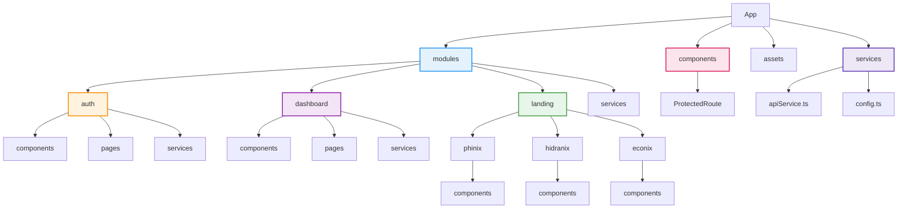
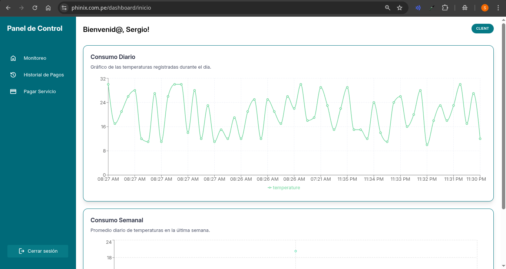
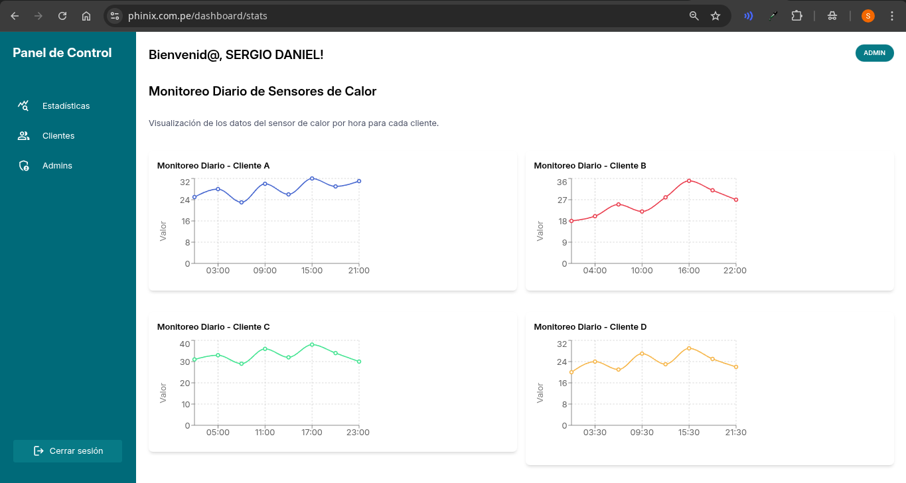
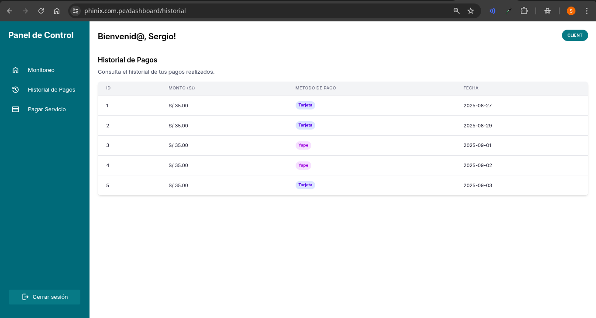
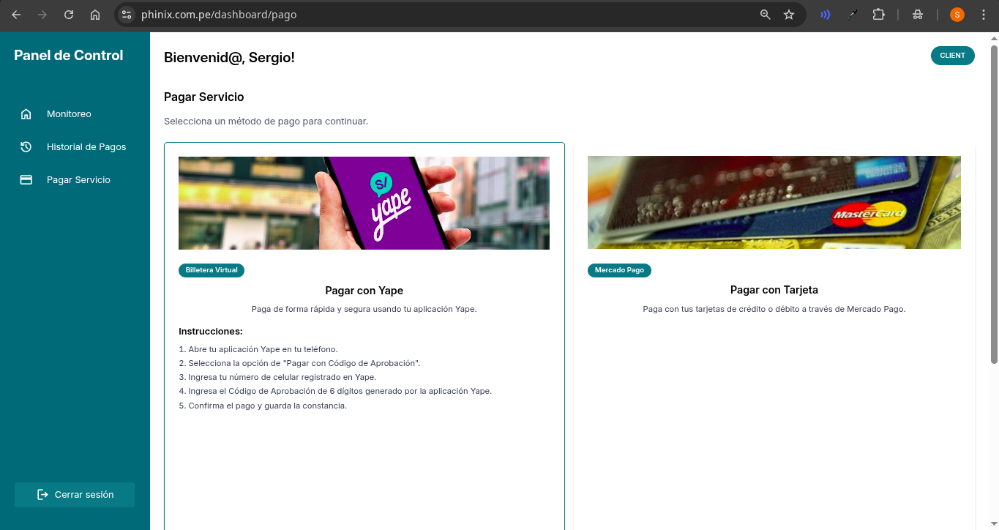

# Hidranix Client

**Hidranix Client** es una aplicación web desarrollada con **React + TypeScript + Vite** que permite visualizar:  
- La **Landing Page general** de **Phinix**.  
- Las **sub-landing pages** de **Hidranix** y **Econix**.  

El objetivo es proporcionar una experiencia unificada para mostrar información corporativa, servicios, novedades y funcionalidades interactivas orientadas a clientes y usuarios finales.

---

## 🚀 Tecnologías y dependencias principales

El proyecto utiliza las siguientes librerías y frameworks:

- **React 19** y **React DOM 19** – Framework principal de la aplicación.  
- **TypeScript** – Tipado estático y mejor mantenibilidad.  
- **Vite** – Herramienta de bundling y desarrollo rápido.  
- **TailwindCSS 4** + **@tailwindcss/vite** – Framework de estilos basado en utilidades.  
- **React Router DOM 7** – Manejo de rutas y navegación entre páginas.  
- **Axios** – Cliente HTTP para comunicación con el backend.  
- **Recharts** – Gráficos y visualizaciones de datos.  
- **React Icons** – Conjunto de íconos listos para usar.  
- **clsx** – Manejo dinámico de clases CSS.  
- **Motion** – Animaciones fluidas para componentes.  
- **MUI (Material UI)** – Componentes UI modernos y personalizables.  
- **@mui/x-data-grid** – DataGrid avanzado para tablas interactivas.  
- **@clerk/clerk-react** – Autenticación de usuarios.  
- **@mercadopago/sdk-react** – Integración con pagos de MercadoPago.  
- **@emotion/react** y **@emotion/styled** – Estilización dinámica junto a MUI.

---

## 📂 Arquitectura

El proyecto implementa el patrón **Screaming Architecture**, lo que significa que la estructura de carpetas refleja los **módulos de negocio** en lugar de detalles técnicos.  

Ejemplo:

```

src/
├── modules/
│   ├── auth/          → Lógica y vistas de autenticación
│   ├── dashboard/     → Panel de administración y cliente
│   ├── landing/       → Landing pages (Phinix, Hidranix, Econix)
│   └── services/      → Servicios compartidos (API, configuración)
├── components/        → Componentes compartidos
├── assets/            → Recursos estáticos (imágenes, logos, pdfs)
└── index.tsx          → Punto de entrada principal

````



Esto permite **alta cohesión** dentro de cada módulo y **bajo acoplamiento** entre ellos.

---

## 🛠️ Scripts

En el directorio del proyecto puedes ejecutar:

### Desarrollo

```bash
npm run dev
````

Ejecuta la aplicación en modo desarrollo usando **Vite**.
La app estará disponible en: [http://localhost:5173](http://localhost:5173).

### Build

```bash
npm run build
```

Construye la aplicación lista para **deploy** en producción.
Los archivos optimizados se generan en el directorio `dist/`.

---

Perfecto 🔥, lo que tienes son **funcionalidades**, pero si lo planteamos como **casos de uso** se vuelve mucho más claro para stakeholders, desarrolladores y testers. Te reescribo cada funcionalidad en formato **Use Case breve**:

---

## 📌 Feature (Casos de Uso)

### 1. **Landing Pages corporativas**

* **Actor**: Visitante externo (potenciales clientes).
* **Objetivo**: Obtener información clara de los servicios de Phinix y sus sub-marcas Hidranix y Econix.
* **Flujo**:

  1. El visitante accede a la página principal de **Phinix**.
  2. Navega hacia las sub-landings de **Hidranix** y **Econix** para conocer ofertas específicas.
  3. Puede dejar datos de contacto o iniciar un registro.

---

### 2. **Dashboard con roles**

* **Actor**: Cliente o Administrador.
* **Objetivo**: Visualizar y gestionar la información según su rol.
* **Flujos**:

  * **Cliente**:

    1. Ingresa al dashboard con sus credenciales.
    2. Consulta su consumo de energía en tiempo real.
    3. Revisa historial de pagos y selecciona métodos de pago disponibles.
  * **Administrador**:

    1. Accede al dashboard como **Admin**.
    2. Gestiona la lista de clientes (altas, bajas, cambios).
    3. Supervisa métricas globales y estadísticas de consumo.

---

### 3. **Autenticación segura con Clerk**

* **Actor**: Usuario registrado o nuevo.
* **Objetivo**: Acceder de manera segura al sistema.
* **Flujo**:

  1. El usuario se registra o inicia sesión mediante Clerk.
  2. El sistema valida identidad y asigna el rol (Cliente o Admin).
  3. Redirige al dashboard según el rol correspondiente.

---

### 4. **Pagos en línea mediante MercadoPago**

* **Actor**: Cliente.
* **Objetivo**: Realizar pagos de manera rápida y segura.
* **Flujo**:

  1. El cliente accede a la sección de pagos en su dashboard.
  2. Selecciona el monto o la factura pendiente.
  3. Escoge medio de pago (tarjeta, billetera virtual, etc.).
  4. MercadoPago procesa la transacción y devuelve confirmación.

---

### 5. **Visualización de datos en tiempo real con Recharts**

* **Actor**: Cliente o Admin.
* **Objetivo**: Interpretar consumos y estadísticas de manera visual.
* **Flujo**:

  1. El sistema recibe datos IoT de temperatura/energía.
  2. Se actualizan en tiempo real en el dashboard.
  3. Los usuarios ven gráficos dinámicos (líneas, barras, comparativas).

---

### 6. **Diseño responsive con TailwindCSS y MUI**

* **Actor**: Cualquier usuario (visitante, cliente, admin).
* **Objetivo**: Acceder a las funcionalidades desde cualquier dispositivo.
* **Flujo**:

  1. El usuario abre la aplicación en desktop, tablet o smartphone.
  2. El sistema adapta automáticamente la interfaz y los componentes.
  3. Se garantiza una experiencia fluida e intuitiva.


## 📸 Capturas

- ***Dashboard Cliente:***



- ***Dashboard Admin:***



- ***Historial de Pagos:***



- ***Pagar Servicio:***



---

## Código

### 🛣️ Manejo de rutas con React Router

La aplicación utiliza **React Router v6** para gestionar la navegación entre páginas. La configuración principal se encuentra en `src/App.tsx` y define las siguientes rutas:

#### 📍 Rutas principales

* `/` → **LandingPhinix**: página principal corporativa.
* `/hidranix` → **LandingHidranix**: sub-landing de la marca Hidranix.
* `/econix` → **LandingEconix**: sub-landing de la marca Econix.
* `/cursos/generacion-y-almacenamiento-para-aplicaciones-energeticas-sostenibles` → **CourseH2V002**: curso específico de Econix.

#### 🔑 Autenticación

* `/login` → **LoginPage**: acceso seguro para clientes y administradores.
* `/register` → **RegisterPage**: registro de nuevos usuarios.

#### 📊 Dashboard

* `/dashboard/*` → **DashboardPage**: panel principal que renderiza vistas internas (según rol **Cliente** o **Admin**).

#### 🚨 Rutas no encontradas

* Cualquier ruta no definida (`*`) redirige automáticamente a la **Landing principal (`/`)**.

---

#### 📄 Fragmento de código (`src/App.tsx`)

```tsx
import {
  BrowserRouter as Router,
  Routes,
  Route,
  Navigate,
} from "react-router-dom";
import LoginPage from "./modules/auth/pages/LoginPage";
import RegisterPage from "./modules/auth/pages/RegisterPage";
import LandingPhinix from "./modules/landing/phinix/LandingPhinix";
import LandingHidranix from "./modules/landing/hidranix/LandingHidranix";
import DashboardPage from "./modules/dashboard/pages/DashboardPage";
import { LandingEconix } from "./modules/landing/econix/LandingEconix";
import { CourseH2V002 } from "./modules/landing/econix/cursos/curso-H2V002/CourseH2V002";

export default function App() {
  return (
    <Router>
      <Routes>
        {/* Landing pages */}
        <Route path="/" element={<LandingPhinix />} />
        <Route path="/hidranix" element={<LandingHidranix />} />
        <Route path="/econix" element={<LandingEconix />} />

        <Route
          path="/cursos/generacion-y-almacenamiento-para-aplicaciones-energeticas-sostenibles"
          element={<CourseH2V002 />}
        />

        {/* Páginas de autenticación */}
        <Route path="/login" element={<LoginPage />} />
        <Route path="/register" element={<RegisterPage />} />

        {/* Dashboard */}
        <Route path="/dashboard/*" element={<DashboardPage />} />

        {/* Redirección en caso de ruta inválida */}
        <Route path="*" element={<Navigate to="/" replace />} />
      </Routes>
    </Router>
  );
}
```

### 🌐 Manejo de peticiones API

Para comunicar el **frontend en React** con el **backend en Node.js/Express**, se utiliza **Axios** configurado en un archivo central (`api.ts`).

Esto permite:

* Definir una **base URL** global (`BACKEND_URL`).
* Enviar las solicitudes con cabeceras comunes (`Content-Type: application/json`).
* Incluir automáticamente cookies y credenciales (`withCredentials: true`).
* Manejar errores de forma **global** mediante interceptores.

De esta manera, cualquier componente puede importar la instancia `api` y reutilizar la configuración sin repetir código.

---

#### 📄 Fragmento de código (`src/api.ts`)

```ts
import axios from 'axios';
import { BACKEND_URL } from './config';

const api = axios.create({
  baseURL: BACKEND_URL, 
  headers: {
    'Content-Type': 'application/json',
  },
  withCredentials: true, // Envío de cookies con las solicitudes
});

// Interceptor para manejar errores globalmente
api.interceptors.response.use(
  (response) => response,
  (error) => {
    if (error.response) {
      console.error('Error de API:', error.response.data);
    } else {
      console.error('Error de red:', error.message);
    }
    return Promise.reject(error);
  }
);

export default api;
```

---

#### 🛠️ Ejemplo de uso en un servicio

```ts
// src/services/temperatureService.ts
import api from '../api';

export const getWeeklyTemperature = async (userId: string) => {
  const { data } = await api.get(`/temperature/weekly/${userId}`);
  return data;
};

export const saveTemperature = async (userId: string, temperature: number) => {
  await api.post('/temperature', { userId, temperature });
};
```

Con esto, el frontend puede hacer peticiones al backend de forma sencilla y robusta.


Perfecto ⚡, aquí te dejo la nueva sección lista para tu README sobre el **manejo de variables de entorno**:

---

### ⚙️ Manejo de variables de entorno

El proyecto utiliza **variables de entorno** para manejar configuraciones sensibles y específicas de cada entorno (desarrollo, pruebas, producción).
Esto evita exponer claves en el código fuente y permite mayor flexibilidad al desplegar en diferentes ambientes.

Se requiere un archivo **`.env`** en la raíz del proyecto con las siguientes variables:

```bash
# URL del backend (entorno de desarrollo)
VITE_BACKEND_URL=http://localhost:5000 

# Clave pública de Clerk para autenticación
VITE_CLERK_PUBLISHABLE_KEY=pk_test_***
```

> ⚠️ Las variables deben comenzar con el prefijo `VITE_` para que puedan ser accesibles desde el frontend cuando se usa **Vite**.

---

#### 📄 Uso en el código

```ts
// src/modules/services/config.ts
export const BACKEND_URL = import.meta.env.VITE_BACKEND_URL as string;
export const CLERK_PUBLISHABLE_KEY = import.meta.env.VITE_CLERK_PUBLISHABLE_KEY as string;
```

De esta manera, las variables se pueden importar desde cualquier componente o servicio del frontend sin exponer datos sensibles directamente en el código.


## 📄 Licencia

Este proyecto es privado y desarrollado como parte del ecosistema **Phinix**.
No está permitido su uso o distribución sin autorización expresa.
