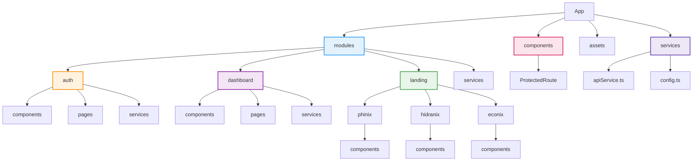

# Hidranix Client

**Hidranix Client** es una aplicación web desarrollada con **React + TypeScript + Vite** que permite visualizar:  
- La **Landing Page general** de **Phinix**.  
- Las **sub-landing pages** de **Hidranix** y **Econix**.  

El objetivo es proporcionar una experiencia unificada para mostrar información corporativa, servicios, novedades y funcionalidades interactivas orientadas a clientes y usuarios finales.

---

## 🚀 Tecnologías y dependencias principales

El proyecto utiliza las siguientes librerías y frameworks:

- **React 19** y **React DOM 19** – Framework principal de la aplicación.  
- **TypeScript** – Tipado estático y mejor mantenibilidad.  
- **Vite** – Herramienta de bundling y desarrollo rápido.  
- **TailwindCSS 4** + **@tailwindcss/vite** – Framework de estilos basado en utilidades.  
- **React Router DOM 7** – Manejo de rutas y navegación entre páginas.  
- **Axios** – Cliente HTTP para comunicación con el backend.  
- **Recharts** – Gráficos y visualizaciones de datos.  
- **React Icons** – Conjunto de íconos listos para usar.  
- **clsx** – Manejo dinámico de clases CSS.  
- **Motion** – Animaciones fluidas para componentes.  
- **MUI (Material UI)** – Componentes UI modernos y personalizables.  
- **@mui/x-data-grid** – DataGrid avanzado para tablas interactivas.  
- **@clerk/clerk-react** – Autenticación de usuarios.  
- **@mercadopago/sdk-react** – Integración con pagos de MercadoPago.  
- **@emotion/react** y **@emotion/styled** – Estilización dinámica junto a MUI.

---

## 📂 Arquitectura

El proyecto implementa el patrón **Screaming Architecture**, lo que significa que la estructura de carpetas refleja los **módulos de negocio** en lugar de detalles técnicos.  

Ejemplo:

```

src/
├── modules/
│   ├── auth/          → Lógica y vistas de autenticación
│   ├── dashboard/     → Panel de administración y cliente
│   ├── landing/       → Landing pages (Phinix, Hidranix, Econix)
│   └── services/      → Servicios compartidos (API, configuración)
├── components/        → Componentes compartidos
├── assets/            → Recursos estáticos (imágenes, logos, pdfs)
└── index.tsx          → Punto de entrada principal

````



Esto permite **alta cohesión** dentro de cada módulo y **bajo acoplamiento** entre ellos.

---

## 🛠️ Scripts

En el directorio del proyecto puedes ejecutar:

### Desarrollo

```bash
npm run dev
````

Ejecuta la aplicación en modo desarrollo usando **Vite**.
La app estará disponible en: [http://localhost:5173](http://localhost:5173).

### Build

```bash
npm run build
```

Construye la aplicación lista para **deploy** en producción.
Los archivos optimizados se generan en el directorio `dist/`.

---

## 📌 Funcionalidades principales

* **Landing Pages corporativas**:

  * Página principal de **Phinix**.
  * Sub-landing de **Hidranix** y **Econix**.

* **Dashboard con roles**:

  * Modo **Admin**: gestión de clientes, monitoreo, estadísticas.
  * Modo **Cliente**: consumo de energía, historial de pagos, métodos de pago.

* **Autenticación segura** con **Clerk**.

* **Pagos en línea** mediante **MercadoPago**.

* **Visualización de datos** en tiempo real con **Recharts**.

* **Diseño responsive** con **TailwindCSS** y **MUI**.

---

## 📸 Capturas

- ***Dashboard Cliente:***


- ***Dashboard Admin:***


- ***Historial de Pagos:***


- ***Pagar Servicio:***


---

## 📄 Licencia

Este proyecto es privado y desarrollado como parte del ecosistema **Phinix**.
No está permitido su uso o distribución sin autorización expresa.

---

```

¿Quieres que también te prepare un **diagrama visual de la arquitectura Screaming Architecture** (por ejemplo, en Mermaid para incluir en el README)?